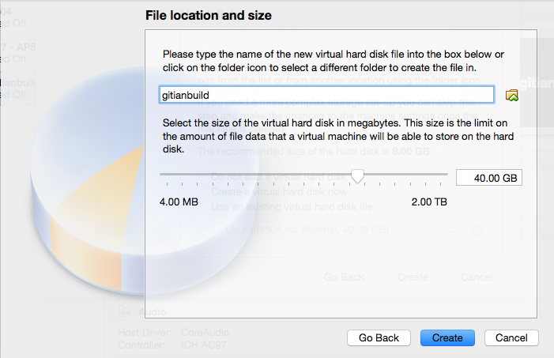

Compilação Gitian
=================

*Instruções de configuração para uma compilação Gitian do Criptoreal Core usando uma VM Debian ou sistema físico.*

Gitian é o processo de compilação determinista que é usado para compilar os executáveis do Criptoreal Core. Ele fornece uma maneira de estar razoavelmente certo de que os executáveis são realmente criados a partir da fonte no GitHub. Ele também garante que as mesmas dependências testadas sejam usadas e compiladas estaticamente no executável.

Vários desenvolvedores compilam o código fonte seguindo um descritor específico ("receita"), assinam o resultado criptograficamente, e fazem o upload da assinatura resultante. Estes resultados são comparados apenas se eles combinarem, a compilação é aceita e carregada em criptoreal.org.

Mais compiladores Gitian são necessários, por isso que este guia existe. É preferível que você siga estas etapas ao invés de usar a imagam VM de outra pessoa para evitar "contaminar"a compilação.

Índice
------

- [Criar uma nova VirtualBox VM](#create-a-new-virtualbox-vm)
- [Conectando a VM](#connecting-to-the-vm)
- [Configurando o Debian para compilação Gitian](#setting-up-debian-for-gitian-building)
- [Instalando Gitian](#installing-gitian)
- [Configurando a imagem Gitian](#setting-up-the-gitian-image)
- [Obtendo e compilando as entradas](#getting-and-building-the-inputs)
- [Compilando Criptoreal Core](#building-criptoreal-core)
- [Compilando um repositório alternativo](#building-an-alternative-repository)
- [Assinando externamente](#signing-externally)
- [Fazendo upload de assinaturas](#uploading-signatures)

Preparando o host para o compilador Gitian
------------------------------------------

O primeiro passo é preparar o ambinete do host que será usado para executar as compilações do Gitian. Este guia explica como configurar o ambiente e como iniciar as compilações.

Debian Linux foi escolhido como a distribuição do host pois possui uma instalação leve (em contraste com o Ubuntu) e está prontamente disponível. Qualquer tipo de virtualização pode ser utilizado, por exemplo:
- [VirtualBox](https://www.virtualbox.org/) (coberto por este guia)
- [KVM](http://www.linux-kvm.org/page/Main_Page)
- [LXC](https://linuxcontainers.org/), veja também [Gitian host docker container](https://github.com/gdm85/tenku/tree/master/docker/gitian-bitcoin-host/README.md).

Você também pode instalar o Gitian no hardware real ao invés de usar a virtualização.

Criar uma nova VirtualBox VM
---------------------------
Na GUI do VirtualBox GUI clique "Novo" e escolha os seguintes parâmetros no assistente:


- Tipo: Linux, Debian (64-bit)


- Tamanho da memória: pelo menos 3000MB, qualquer coisa a menos e a compilação pode não ser concluída.


- Disco rígido: Criar um disco rígido virtual agora


- Tipo de arquivo do disco rígido: Use o padrão, VDI (VirtualBox Disk Image)


- Armazenamento no disco rígido físico: atribuído dinamicamente



- Localização e tamanho do arquigo: pelo menos 40GB; por volta de 20GB *pode* ser possível, mas é melhor errar no lado seguro
- Clique `Create`

Após criar a VM, precisamos configurá-la.

- Clique no botão `Settings` , depois vá para a aba `Network`. Adaptador 1 deve estar selecionado como `NAT`.


- Clique `Advanced`, depois `Port Forwarding`. Nós queremos configurar uma porta através da qual possamos alcançar a VM para obter aquivos dentro e fora.
- Crie uma nova regra clicando no botão com sinal de mais.


- Configure a nova regra da seguinte maneira:
  - Nome: `SSH`
  - Protocolo: `TCP`
  - Deixe Host IP vazio
  - Porta do Host: `22222`
  - Deixe o Guest IP vazio
  - Porta Guest: `22`

- Clique `Ok` duas vezes para salvar.

Pegue o [instalador Debian 8.x](http://cdimage.debian.org/mirror/cdimage/archive/8.5.0/amd64/iso-cd/debian-8.5.0-amd64-netinst.iso) (uma versão secundária mais recente também deve funcionar, veja também [Debian Network installation](https://www.debian.org/CD/netinst/)).
Esta imagem de DVD pode ser [validada](https://www.debian.org/CD/verify) usando uma hashing tool SHA256, por exemplo no Unixy OSes informando o seguinte no terminal:

    echo "ad4e8c27c561ad8248d5ebc1d36eb172f884057bfeb2c22ead823f59fa8c3dff  debian-8.5.0-amd64-netinst.iso" | sha256sum -c
    # (must return OK)

Então inicie a VM. Na primeira vez em que carregar o sistema, será solicitado a imagem de um DVD ou CD. Escolha a iso que foi baixada anteriormente.


Instalando Debian
------------------

Esta parte irá explicar como instalar o Debian na VM recém criada.

- Escolha o instalador não gráfico.  Não precisamos do ambiente gráfico; ele apenas aumentará o tempo de instalação e espaço em disco.


**Nota**: Navegando pelo instalador Debian: Para manter uma configuração padrão e continuar, apenas clique `Enter`. Para selecionar um botão diferente, pressione `Tab`.

- Escolha configurações locais e a do teclado (não importa, você pode simplesmente manter as configurações ou colocar sua própria informação)


- A VM detectará configurações de rede usando DHCP, isto deve ser feito automaticamente
- Configure a rede:
  - Hostname `debian`.
  - Deixe o nome de domínio vazio.


- Escolha uma senha de root e tecle enter (guarde essa senha para uso mais tarde)


- Nomeie o novo usuário `debian` (o nome completo não importa, você pode deixar isso vazio)
- Configure o username da conta como `debian`


- Escolha uma senha de usuário e informe duas vezes (guarde esta senha para uso posterior)


- O instalador irá configurar o relógio usando um servidor de horário; este processo deve ser automático
- Configure o relógio: escolha um fuso horário (depende das configurações de localidade que você escolheu anteriormente; especificações não importam)  


- Configuração de disco
  - Método de particionamento: Guiado - Use todo o disco


  - Selecione disco para partição: SCSI1 (0,0,0)


  - Discos de partição -> *Todos os arquivos em uma única partição*


  - Termine o particionamento e grave as mudanças no disco -> *Sim* (`Tab`, `Enter` para selecionar o botão `Yes`)


- O sistema base será instalado, isto levará um minuto ou mais
- Escolha um espelho (qualquer um serve)


- Digite as informações de proxy (a não ser que você esteja usando intranet, deixe isto vazio)


- Aguarde um momento enquanto o 'Selecione e instale software' é executado
- Participar no concurso de popularidade -> *Não*
- Escolha o software para instalar. Precisamos apenas do sistema base.
- Certifique-se de que somente 'SSH server' e 'Standard System Utilities' estejam marcados
- Desmarque 'Debian Desktop Environment' e 'Print Server'


- Instale o boot loader GRUB no registro mestre de inicialização? -> Sim


- Dispositivo para a instalação do boot loader -> ata-VBOX_HARDDISK


- Instalação completa -> *Continue*
- Após instalação, a VM irá reiniciar e você terá uma VM Debian totalmente funcional. Parabéns!


Após a Instalação
-------------------
O próximo passo no guia envolve iniciar sessão como root via SSH. O login SSH para usuários root está desativado por padrão, devemos habilitar isso agora.

Faça o login na VM com o username `root` e com a senha de root que você escolheu anteriormente. Você deverá ver uma tela parecida com esta.


Digite:

```
sed -i 's/^PermitRootLogin.*/PermitRootLogin yes/' /etc/ssh/sshd_config
```
pressione enter. Então,
```
/etc/init.d/ssh restart
```
e pressione enter para reiniciar o SSH. Faça o logout digitando 'logout' e pressionando 'enter'.

Conectando a VM
----------------------

Após a inicialização da VM você já pode se conectar usando SSH, os arquivos podem ser copiados para a VM usando um programa de SFTP.
Conecte a `localhost`, porta `22222` (ou a porta que você escolheu ao configurar a VM). No Windows você pode usar [putty](http://www.chiark.greenend.org.uk/~sgtatham/putty/download.html) e [WinSCP](http://winscp.net/eng/index.php).

Por exemplo, para conectar como `root` no prompt de comando Linux use

    $ ssh root@localhost -p 22222
    The authenticity of host '[localhost]:22222 ([127.0.0.1]:22222)' can't be established.
    RSA key fingerprint is ae:f5:c8:9f:17:c6:c7:1b:c2:1b:12:31:1d:bb:d0:c7.
    Are you sure you want to continue connecting (yes/no)? yes
    Warning: Permanently added '[localhost]:22222' (RSA) to the list of known hosts.
    root@localhost's password: (enter root password configured during install)

    The programs included with the Debian GNU/Linux system are free software;
    the exact distribution terms for each program are described in the
    individual files in /usr/share/doc/*/copyright.

    Debian GNU/Linux comes with ABSOLUTELY NO WARRANTY, to the extent
    permitted by applicable law.
    root@debian:~#

Substitua `root` por `debian` para logar como usuário.

Configurando o Debian para compilação Gitian
--------------------------------------------

Nesta seção, estaremos configurando a instalação Debian para a compilação Gitian.

Primeiro, precisamos fazer login como `root` para configurar dependências e garantir que nosso usuário possa usar o comando sudo. Copie/cole o seguinte comando no terminal:

```bash
apt-get install git ruby sudo apt-cacher-ng qemu-utils debootstrap lxc python-cheetah parted kpartx bridge-utils make ubuntu-archive-keyring curl
adduser debian sudo
```

Em seguida, configura o LXC e o restante com as linhas a seguir, que nada mais é do que uma confusão complexa de configurações e soluções alternativas:

```bash
# a versão do lxc-start no Debian precisa ser executado como root, então certifique-se
# de que o script de compilação pode executá-lo sem fornecer uma senha
echo "%sudo ALL=NOPASSWD: /usr/bin/lxc-start" > /etc/sudoers.d/gitian-lxc
echo "%sudo ALL=NOPASSWD: /usr/bin/lxc-execute" >> /etc/sudoers.d/gitian-lxc
# make /etc/rc.local script that sets up bridge between guest and host
echo '#!/bin/sh -e' > /etc/rc.local
echo 'brctl addbr br0' >> /etc/rc.local
echo 'ifconfig br0 10.0.3.2/24 up' >> /etc/rc.local
echo 'iptables -t nat -A POSTROUTING -o eth0 -j MASQUERADE' >> /etc/rc.local
echo 'echo 1 > /proc/sys/net/ipv4/ip_forward' >> /etc/rc.local
echo 'exit 0' >> /etc/rc.local
# Tenha certeza de que USE_LXC está sempre habilitado ao logar como debian,
# e configure endereços LXC IP 
echo 'export USE_LXC=1' >> /home/debian/.profile
echo 'export GITIAN_HOST_IP=10.0.3.2' >> /home/debian/.profile
echo 'export LXC_GUEST_IP=10.0.3.5' >> /home/debian/.profile
reboot
```

No final, a VM é reiniciada para garantir que as alterações tenham efeito. Os passos desta seção só precisam ser executados uma única vez.

Instalando Gitian
------------------

Refaça o login com o usuário `debian` que foi criado durante a instalação. O restante dos passos desde guia serão executados com este usuário.

Não existe o pacote `python-vm-builder` no Debian, então nós mesmos devemos instalar a partir da fonte,

```bash
wget http://archive.ubuntu.com/ubuntu/pool/universe/v/vm-builder/vm-builder_0.12.4+bzr494.orig.tar.gz
echo "76cbf8c52c391160b2641e7120dbade5afded713afaa6032f733a261f13e6a8e  vm-builder_0.12.4+bzr494.orig.tar.gz" | sha256sum -c
# (verificação -- deve retornar OK)
tar -zxvf vm-builder_0.12.4+bzr494.orig.tar.gz
cd vm-builder-0.12.4+bzr494
sudo python setup.py install
cd ..
```

**Nota**: Quando o sudo pedir uma senha, informe a senha para o usuário *debian* não o *root*.

Clone os repositórios git para criptoreal e Gitian.

```bash
git clone https://github.com/devrandom/gitian-builder.git
git clone https://github.com/criptoreal/criptoreal
git clone https://github.com/CriptoReal/gitian.sigs.cripto.git
```

Configurando a imagem Gitian 
----------------------------

Gitian precisa de uma imagem virtual do sistema operacional para compilar. Atualmente é a Ubuntu Trusty x86_64.
Esta imagem será copiada e usada sempre que uma compilação for iniciada para garantir que esta compilação seja determinista.
Criar a imagem levará um tempo, mas precisa ser feita uma única vez.

Execute o seguinte como usuário `debian`:

```bash
cd gitian-builder
bin/make-base-vm --lxc --arch amd64 --suite trusty
```

Você verá muitos avisos na tela durante a instalação da imagem. Basta ignorá-los.

**Nota**: Quando sudo pedir uma senha, informe a senha para o usuário *debian* não para *root*.

Obtendo e compilando as entradas
--------------------------------

Neste ponto você tem duas opções, você pode tentar usar o script automático (encontrado em [contrib/gitian-build.sh](/contrib/gitian-build.sh)) ou você pode fazer tudo manualmente seguindo este guia. Se você está usando o script automático, execute-o com o comando "--setup". Depois, execute o comando "--build" (exemplo: "contrib/gitian-building.sh -b signer 0.13.0"). Caso contrário ignore isto.

Siga as instruções em [doc/release-process.md](release-process.md#fetch-and-create-inputs-first-time-or-when-dependency-versions-change)
no repositório criptoreal dentro de 'Obter e criar entradas' para instalar fontes que requerem invervenção manual. Você pode opcionalmente seguir o próximo passo: 'Semeie o cache de fontes do Gitian e os repositórios git offline' que irá buscar os arquivos restantes necessários para a compilação offline.

Compilando o Criptoreal Core
----------------

Para compilar o Criptoreal Core (para Linux, OS X e Windows) apenas siga os passos em 'fazer compilações Gitian' em [doc/release-process.md](release-process.md#perform-gitian-builds) no repositório criptoreal.

Isto pode levar algum tempo, pois ele irá criar todas as dependências necessárias para cada descritor. Estas dependências serão armazenadas em cache após uma compilação bem-sucedida para evitar uma recompilação quando possível.

A qualquer momento, você pode verificar a instalação do pacote e compilar o progresso com

```bash
tail -f var/install.log
tail -f var/build.log
```

A saída de `gbuild` será algo parecido com

    Initialized empty Git repository in /home/debian/gitian-builder/inputs/criptoreal/.git/
    remote: Counting objects: 57959, done.
    remote: Total 57959 (delta 0), reused 0 (delta 0), pack-reused 57958
    Receiving objects: 100% (57959/57959), 53.76 MiB | 484.00 KiB/s, done.
    Resolving deltas: 100% (41590/41590), done.
    From https://github.com/criptoreal/criptoreal
    ... (new tags, new branch etc)
    --- Building for trusty amd64 ---
    Stopping target if it is up
    Making a new image copy
    stdin: is not a tty
    Starting target
    Checking if target is up
    Preparing build environment
    Updating apt-get repository (log in var/install.log)
    Installing additional packages (log in var/install.log)
    Grabbing package manifest
    stdin: is not a tty
    Creating build script (var/build-script)
    lxc-start: Connection refused - inotify event with no name (mask 32768)
    Running build script (log in var/build.log)

Compilando um repositório alternativo
-------------------------------------

Se você quiser fazer uma compilação de teste de um pull no GitHub, pode ser útil apontar o compilador Gitian em um repositório alternativo, usando os mesmos descritores e entradas.

Por exemplo:
```bash
URL=https://github.com/thrasher-/criptoreal.git
COMMIT=2014_03_windows_unicode_path
./bin/gbuild --commit criptoreal=${COMMIT} --url criptoreal=${URL} ../criptoreal/contrib/gitian-descriptors/gitian-linux.yml
./bin/gbuild --commit criptoreal=${COMMIT} --url criptoreal=${URL} ../criptoreal/contrib/gitian-descriptors/gitian-win.yml
./bin/gbuild --commit criptoreal=${COMMIT} --url criptoreal=${URL} ../criptoreal/contrib/gitian-descriptors/gitian-osx.yml
```

Compilando totalmente offline
-----------------------------

Para compilar de maneira totalmente offline, incluindo anexar assinaturas a compilações ainda não assinadas, o repositório sigs destacado e o repositório git criptoreal com a tag desejada devem estar disponíveis localmente e em seguida, o gbuild deve ser informado sobre onde encontrá-los. Também requer um apt-cacher-ng que esteja totalmente preenchido, mas configurado para o modo offline, ou desabilitando manualmente o uso do gitian-builder do apt-get para atualizar o ambiente de compilação VM.

Para configurar o apt-cacher-ng como um cache offline, você precisará primeiro preencher seu cache com os arquivos relevantes. Você deve também corrigir o binário/bootstrap-fixup para definir as apt sources de maneira diferente da qual o simples archive.ubuntu.com: us.archive.ubuntu.com funciona.

Então, se você usa LXC:

```bash
export PATH="$PATH":/path/to/gitian-builder/libexec
export USE_LXC=1
cd /path/to/gitian-builder
./libexec/make-clean-vm --suite trusty --arch amd64

LXC_ARCH=amd64 LXC_SUITE=trusty on-target -u root apt-get update
LXC_ARCH=amd64 LXC_SUITE=trusty on-target -u root \
  -e DEBIAN_FRONTEND=noninteractive apt-get --no-install-recommends -y install \
  $( sed -ne '/^packages:/,/[^-] .*/ {/^- .*/{s/"//g;s/- //;p}}' ../criptoreal/contrib/gitian-descriptors/*|sort|uniq )
LXC_ARCH=amd64 LXC_SUITE=trusty on-target -u root apt-get -q -y purge grub
LXC_ARCH=amd64 LXC_SUITE=trusty on-target -u root -e DEBIAN_FRONTEND=noninteractive apt-get -y dist-upgrade
```

E em seguida, defina o modo offline para apt-cacher-ng:

```
/etc/apt-cacher-ng/acng.conf
[...]
Offlinemode: 1
[...]

service apt-cacher-ng restart
```

Então ao compilar, substitua as URLs remotas que gbuild poderia extrair dos descritores Gitian::
```bash

cd /some/root/path/
git clone https://github.com/criptoreal/criptoreal-detached-sigs.git

BTCPATH=/some/root/path/criptoreal
SIGPATH=/some/root/path/criptoreal-detached-sigs

./bin/gbuild --url criptoreal=${BTCPATH},signature=${SIGPATH} ../criptoreal/contrib/gitian-descriptors/gitian-win-signer.yml
```

Assinando externamente
----------------------

Se você quer fazer a assinatura PGP em outro dispositivo, isto também é possível; basta definir `SIGNER` como mencionado e seguir as etapas no processo de compilação da maneira normal.

    gpg: skipped "laanwj": chave secreta não encontrada

Quando você executa `gsign` você receberá um erro do GPG, que não pode ser ignorado. Copie os arquivos `.assert` resultantes em `gitian.sigs` em sua máquina de assinaturas e faça

```bash
    gpg --detach-sign ${VERSION}-linux/${SIGNER}/criptoreal-linux-build.assert
    gpg --detach-sign ${VERSION}-win/${SIGNER}/criptoreal-win-build.assert
    gpg --detach-sign ${VERSION}-osx-unsigned/${SIGNER}/criptoreal-osx-build.assert
```

Isto irá criar os arquivos `.sig` que podem ser usados juntamente com os arquivos `.assert` files para afirmar sua compilação Gitian.

Fazendo upload de assinaturas
-----------------------------

Após a compilação e a assinatura você pode enviar suas assinaturas (tanto o arquivo `.assert` quanto o `.assert.sig`) para o
[criptoreal/gitian.sigs.cripto](https://github.com/criptoreal/gitian.sigs.cripto/) repositório criptoreal ou se isso não for possível, crie uma pull request. Você também pode enviar os arquivos para thrasher (thrasher@addictionsofware.com) e ele cuidará de cometer estes arquivos.
